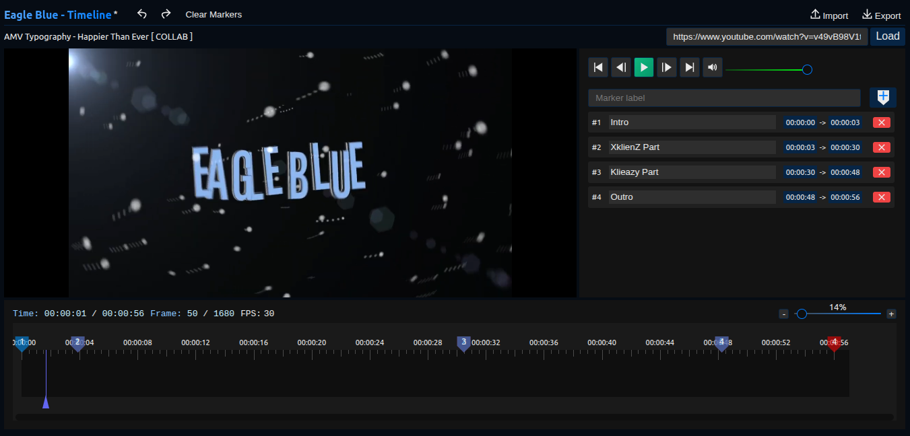

<h1 style="text-align: center; font-size: 3rem;background: linear-gradient(90deg, #59a9ff, #007bffff);-webkit-background-clip: text; -webkit-text-fill-color: transparent; background-clip: text;">Eagle Blue - Timeline</h1>

# 

This project implements a non-linear timeline editor designed for precise video navigation, annotation, and segment control.  
Markers are not simple bookmarks — they define **time ranges** that represent logical segments of the video.

---

## Marker Concept

A **marker** represents a **time boundary** in the timeline.  
Markers are always used in **pairs** to define a **segment**.

Each marker pair defines:

- A **start time**
- An **end time**
- A **segment duration**

Segments are the core unit of editing and playback control.

---

## Marker Pairing Rules

Markers follow strict pairing rules:

| Rule                                 | Description                                               |
| ------------------------------------ | --------------------------------------------------------- |
| Markers must be paired               | A single marker cannot exist on its own                   |
| Markers are ordered                  | First marker = segment start, second marker = segment end |
| Pairs cannot overlap                 | One segment cannot partially overlap another              |
| Removing one marker removes its pair | Segments are atomic                                       |

This guarantees timeline consistency and prevents corrupted ranges.

---

## Segment Duration Constraint

Each marker pair must define a **minimum duration of 3 seconds**.

This prevents:

- Accidental micro-segments
- Zero-length markers
- Unusable editing ranges

If a user attempts to place a marker too close:

- The action is rejected
- Or the marker snaps to the minimum valid distance

---

## Marker Labels

Each marker may have a **text label** describing its purpose.

Rules:

- Labels are **optional**
- Maximum length: **240 characters**
- Labels are plain text

Labels are stored with the marker data and exported with the timeline.

---

## Marker States

A marker pair (segment) can be in one of the following states:

| State    | Description                         |
| -------- | ----------------------------------- |
| Active   | Currently selected or being edited  |
| Inactive | Exists but not selected             |
| Disabled | Temporarily ignored during playback |
| Deleted  | Removed via undoable command        |

All marker state changes are tracked by the command system.

---

## Timeline Integrity

The system enforces the following guarantees:

- The timeline is always partitioned into valid, non-overlapping segments
- Every segment has a meaningful duration
- Undo / Redo can never produce broken marker pairs
- Exported timelines are always structurally valid

This ensures timeline data can be safely saved, shared, and reloaded.

---

## Why This Design Exists

Using paired markers with a minimum duration enables:

- Batch processing
- Precise trimming
- Exportable edit decisions

Markers represent **structured editing data**, not just visual points.

---

# Keyboard Shortcuts

This application provides a set of Keyboard Shortcuts designed to improve workflow efficiency when working with video playback and timeline editing.

---

## Notes

- Keyboard shortcuts are disabled while typing in input fields, text areas, or editable content to avoid unintended actions.
- The **Space** key is protected against key repeat, so holding it down will not toggle playback multiple times.

---
